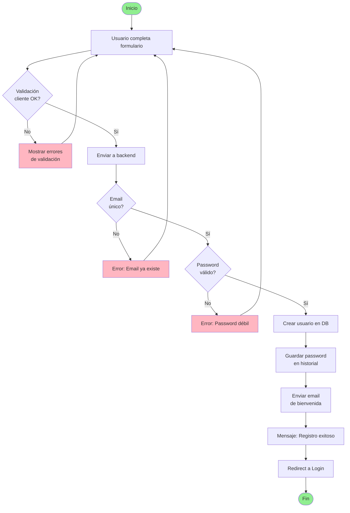
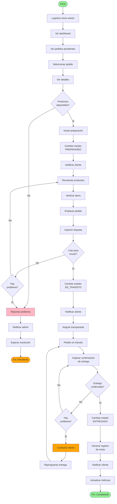
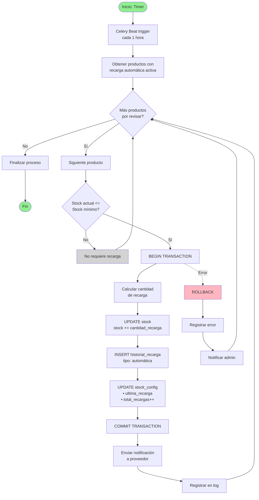
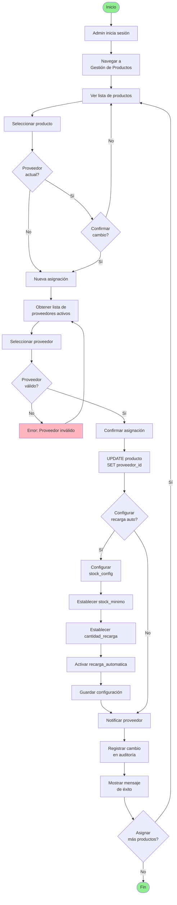
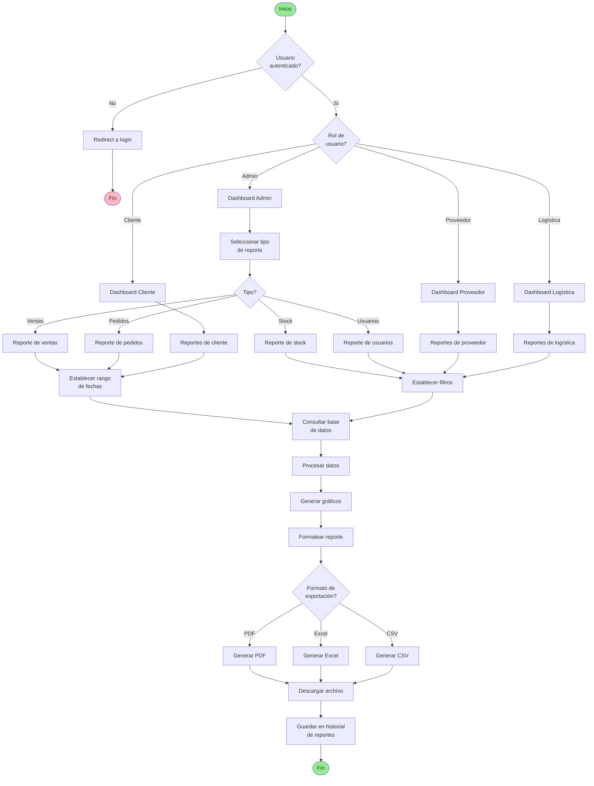
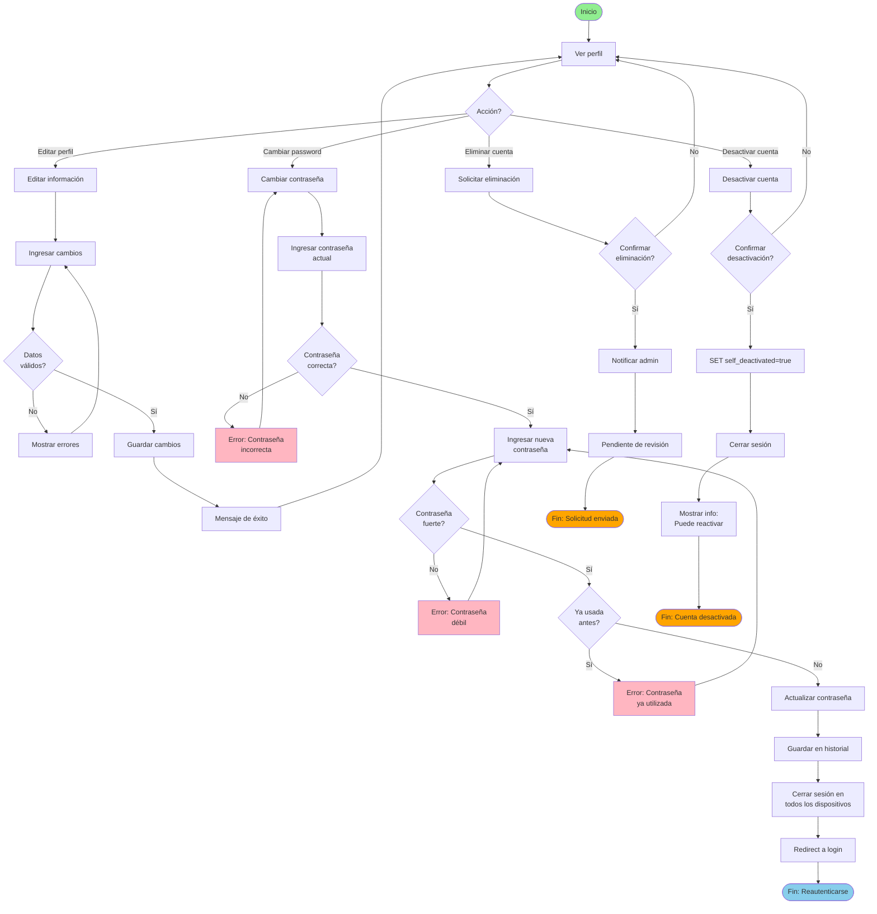

# 🔀 DIAGRAMAS DE ACTIVIDAD - PREXCOL

**Proyecto**: PREXCOL  
**Fecha**: 2025-12-04  
**Tipo**: Diagramas de Comportamiento - Flujos de Proceso

---

## 📋 ÍNDICE

1. [Registro de Usuario](#registro-de-usuario)
2. [Proceso de Compra Completo](#proceso-de-compra-completo)
3. [Gestión de Pedido (Logística)](#gestión-de-pedido-logística)
4. [Recarga Automática de Stock](#recarga-automática-de-stock)
5. [Asignación de Productos a Proveedor](#asignación-de-productos-a-proveedor)

---

## 👤 REGISTRO DE USUARIO



---

## 🛒 PROCESO DE COMPRA COMPLETO

```mermaid
flowchart TD
    Start([Inicio: Cliente en catálogo]) --> Browse[Navegar productos]
    Browse --> SelectProduct[Seleccionar producto]
    SelectProduct --> ViewDetails[Ver detalles]
    
    ViewDetails --> CheckStock{Stock<br/>disponible?}
    CheckStock -->|No| OutOfStock[Mostrar "Agotado"]
    OutOfStock --> Browse
    
    CheckStock -->|Sí| AddCart[Agregar al carrito]
    AddCart --> MoreProducts{Agregar<br/>más productos?}
    
    MoreProducts -->|Sí| Browse
    MoreProducts -->|No| ViewCart[Ver carrito]
    
    ViewCart --> AdjustQty{Ajustar<br/>cantidades?}
    AdjustQty -->|Sí| ModifyCart[Modificar carrito]
    ModifyCart --> ViewCart
    
    AdjustQty -->|No| Checkout[Proceder al pago]
    Checkout --> ValidateStock{Todo el stock<br/>disponible?}
    
    ValidateStock -->|No| StockError[Error: Stock insuficiente]
    StockError --> ViewCart
    
    ValidateStock -->|Sí| SelectPayment[Seleccionar método<br/>de pago]
    SelectPayment --> PaymentMethod{Método?}
    
    PaymentMethod -->|Tarjeta| EnterCard[Ingresar datos<br/>de tarjeta]
    PaymentMethod -->|Transferencia| UploadProof[Subir comprobante]
    PaymentMethod -->|PSE| LoginBank[Login banco]
    
    EnterCard --> ProcessPayment[Procesar pago]
    UploadProof --> ProcessPayment
    LoginBank --> ProcessPayment
    
    ProcessPayment --> PaymentResult{Pago<br/>exitoso?}
    
    PaymentResult -->|No| PaymentFailed[Pago rechazado]
    PaymentFailed --> RetryPayment{Reintentar?}
    RetryPayment -->|Sí| SelectPayment
    RetryPayment -->|No| CancelOrder[Cancelar orden]
    CancelOrder --> End1([Fin: Sin pedido])
    
    PaymentResult -->|Sí| CreateOrder[Crear pedido]
    CreateOrder --> ReduceStock[Reducir stock]
    ReduceStock --> SendNotifications[Enviar notificaciones<br/>• Cliente<br/>• Logística<br/>• Proveedor]
    SendNotifications --> ShowConfirmation[Mostrar confirmación<br/>con número de pedido]
    ShowConfirmation --> SendConfirmEmail[Enviar email<br/>de confirmación]
    SendConfirmEmail --> End2([Fin: Pedido creado])
    
    style Start fill:#90EE90
    style End1 fill:#FFB6C1
    style End2 fill:#90EE90
    style OutOfStock fill:#FFA500
    style StockError fill:#FFB6C1
    style PaymentFailed fill:#FFB6C1
```

---

## 🚚 GESTIÓN DE PEDIDO (LOGÍSTICA)



---

## 🔄 RECARGA AUTOMÁTICA DE STOCK



---

## 👨‍💼 ASIGNACIÓN DE PRODUCTOS A PROVEEDOR



---

## 📊 GENERACIÓN DE REPORTES



---

## 🔐 GESTIÓN DE CUENTA DE USUARIO



---

**Documento generado**: 2025-12-04  
**Versión**: 1.0  
**Estado**: ✅ Completado
